# Setting up first ADF Pipeline

## Creating Linked Services

1. Inside ingestion resource group [`rg-nibc-ingestion-<environment>`], select adf [`adf-nibc-ingestion-<environment>`] instance and click on Launch studio.

2. We need to create **linked services** that will define connection information to a data store or compute. Click on `Manage`, then on `Linked Services` and finally in `New`.

3. We need to define connections to our source data (for example, a SQL Server instance, Azure Blob Storage, KeyVault).

   3.1 Select Azure Blob Storage

    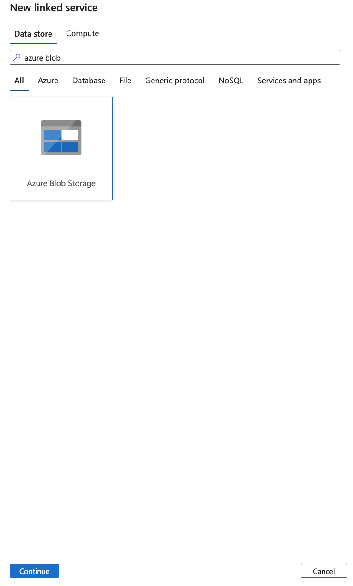

    - To set up the connection, we need to use global parameters for storage account so each instance we deploy (dev, test, prd) has the correct one automatically generated.

    - Check the name of the parameter under `Global parameters`, and on `Parameters` section inside connection configuration, add a new one with same name, in this case we are using `storage_account_uri` with url path to landing blob storage.

    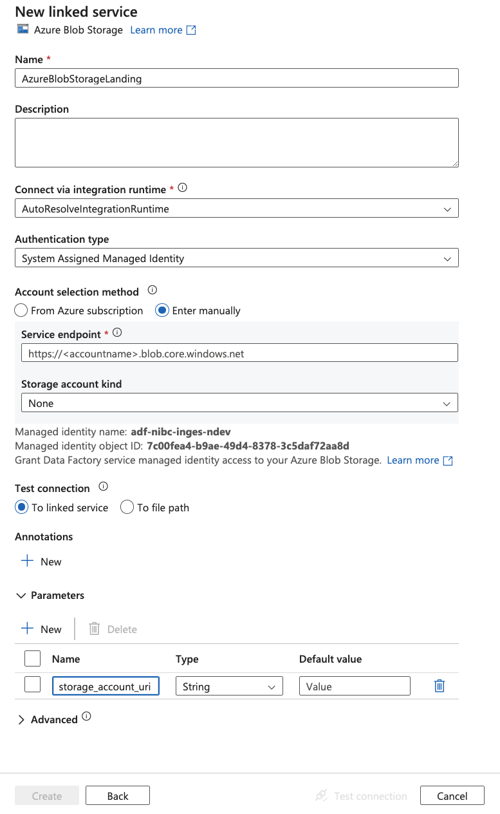

    - Then under `Service endpoint`, click on Add dynamic content.

    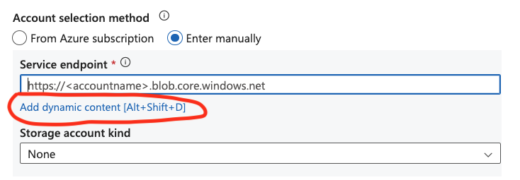

    - A new tab will be open and you can click on parameter you want to add dynamically. 

    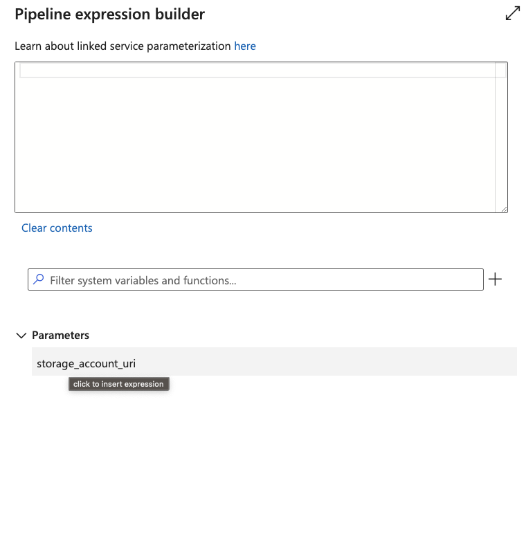

   3.2 KeyVault
   You will do same procedure to create Key Vault Linked Service. In this case you need to define the same name as the one defined in global parameters, this will be the variable used by the pipeline later to populate this field.

    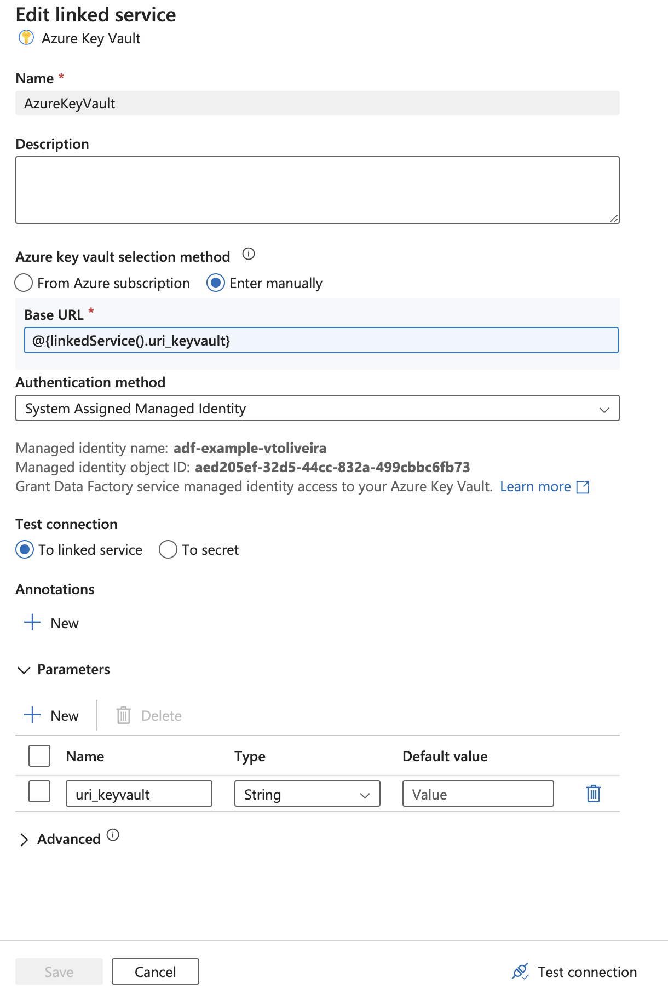

   3.2 SQL Server

    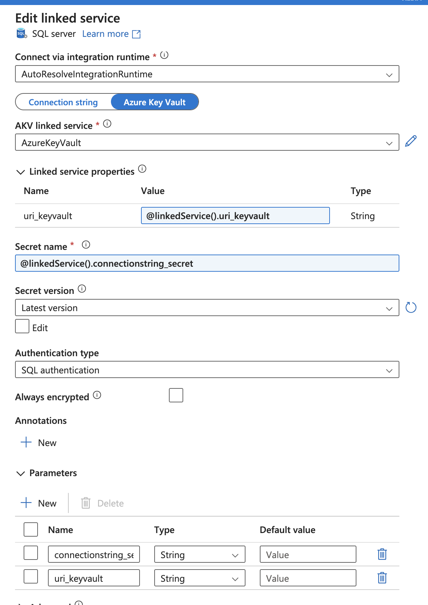

    For SQL Server, for instance, you define the credentials by using `Azure Key Vault` and then you create the variable and populate it using the option `add dynamic variables`. Then you define another variable that will contain your string secret.

## Creating DataSets

As an example, let's create a DataSet instance for a SQL Server. In this scenario, we are defining tables manually, and by clicking Ok you can add variables dynamically.

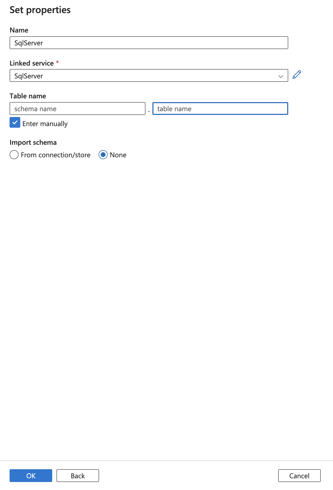

Here we are defining schema and table's parameters using dynamic values such as `datastore_name` and `dataset_name`, that will be populate by the YAML file.

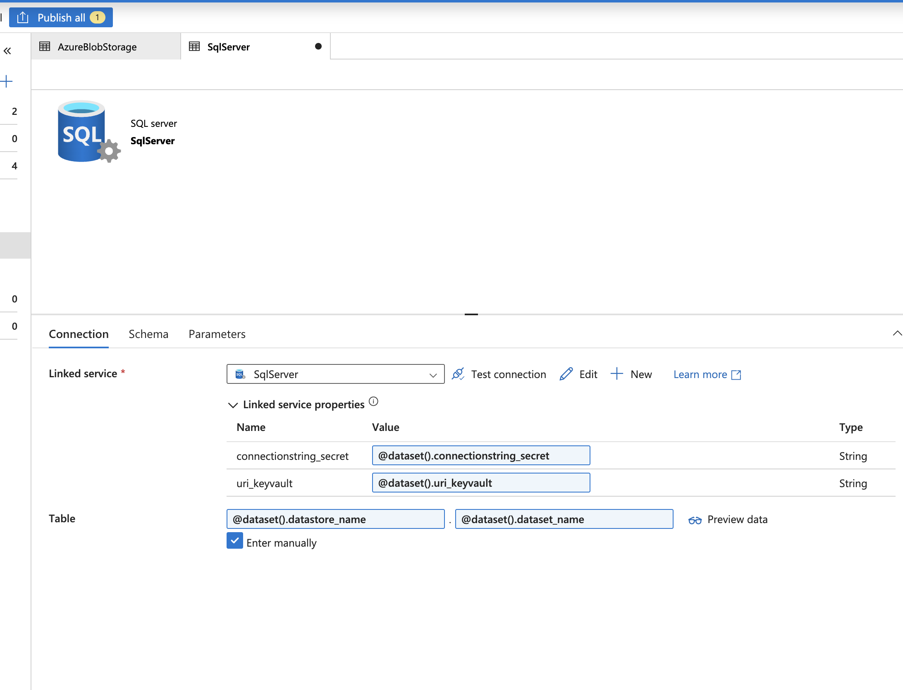

After that you can select variables dynamically:

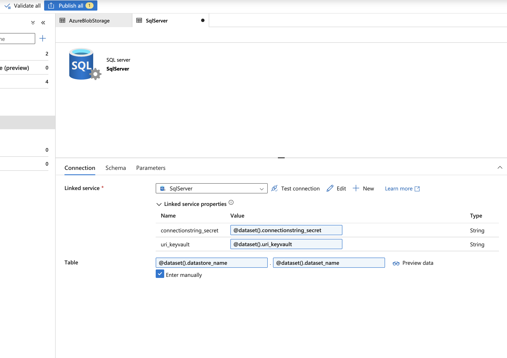

Thus those variables will be filled by the pipeline which will use YAML file configuration under `pipelines/` folder with datastore names, datasets names, and all relevant configuration.

## Creating Pipelines

Finally, we are creating our pipelines. Those pipelines will be used by the YAML file to populate parameters via scheduling triggers. Therefore, we must create a pipeline for each general use case we have, for example, in this case we are using a **SqlServerCopy** where we have a `copy` task to move data from a SQL Server to an Azure Blob Storage.

Source configuration:

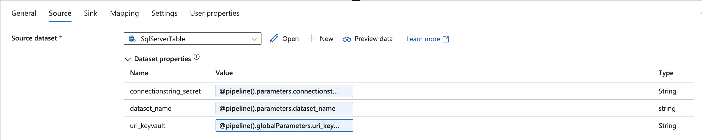

You can see that for `uri_keyvault` parameter we are using a global parameter as discussed before.

Sink configuration:

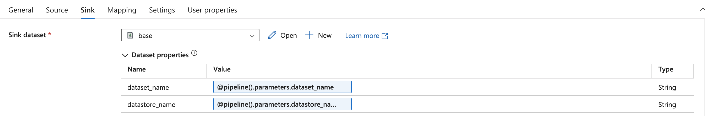

 

    
